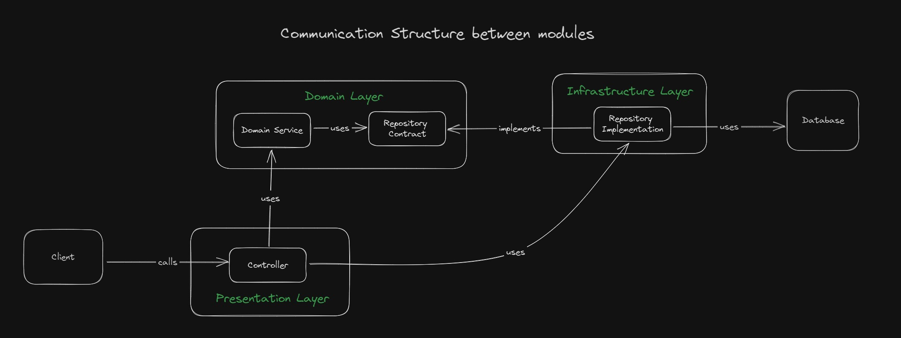

# Spotify Clone Backend with Typescript

This is a repository that persist all source code for the spotify clone that is used for teaching to my students in the curse of **Full Stack Web Development**.
